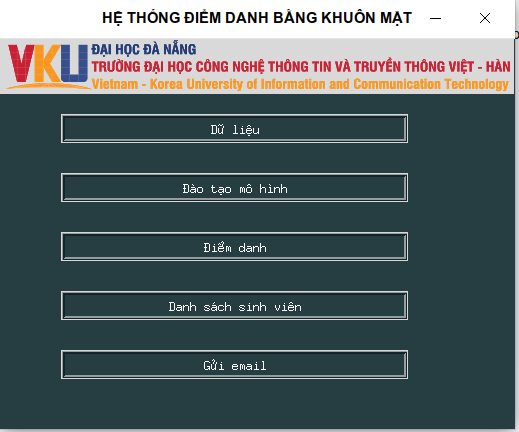

Chương trình điểm danh bằng khuôn mặt bằng opencv
1. Login
2. Bang dieu khien ok
-dung ui
-goi ham

3. Dữ lệu ok
-form
-chup ảnh và save vào data

4. Đào tạo mô hình 
-duyet ảnh
-xử dụng thuat toán nào
-luu du liêu

5. Điểm danh
-form diem danh
-truyền vào các tham số nào
-điểm danh nhiều môn học
-danh sách sinh viên trong buổi học
-làm việc với thư viện thời gian

-xu ly sinh vien vang mat

(6. Gửi email)

